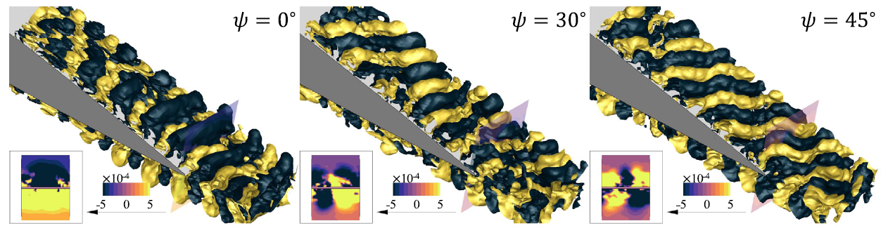

# About Me

I am a postdoctoral researcher in the Department of Mechanical and Aerospace Engineering at UC San Diego, working with Dr. John Hwang in the Large-Scale Design Optimization (LSDO) Lab since 2024. I earned my Ph.D. from UC Davis under the guidance of Dr. Seongkyu Lee.

My research lies at the intersection of aeroacoustics and aerodynamic shape optimization using computational fluid dynamics (CFD). I aim to elucidate the fundamental mechanisms of noise generation in turbulent flows and develop efficient methods for optimizing aircraft performance and design.

---

# Research Interests

## 1. Aerodynamics and Computational Fluid Dynamics (CFD)

- Developed and validated high-fidelity CFD simulations for a wide range of aerospace configurations, including VTOL aircraft, ducted fan and vane, blended-wing body (BWB) designs, and generic fighter aircraft (KF-21).
- Performed 6-DOF aerodynamic simulations involving control surface deflection, thrust vectoring, and stability/control (S&C) analysis using **Star-CCM+**, **OpenFOAM**, and **DAFoam**.
- Investigated flow phenomena across hover, transition, and cruise regimes, with a focus on vortex flows, flow interference, and buffet at high angles of attack.
- Modified and utilized CFD solvers including:
  - `OpenFOAM v2012` (wall-resolved LES)
  - `DAFoam v4.0`, `SU2 v8.2.0` (adjoint)
  - In-house Fortran-based FVM solver
- Proficient in:
  - **CAD**: CATIA, OpenVSP   
  - **Meshing**: pyHyp, Pointwise, Gmsh  
  - **Visualization**: Tecplot, ParaView, FieldView

## 2. Aerodynamic Shape Optimization (ASO)

- Built a modular **ASO framework** using **CSDL**, interfaced with **DAFoam** and key design components:
  - `pyHyp` for volume meshing
  - `IDWarp` for mesh deformation
  - `modopt` for gradient-based optimization
- Implemented and tested **projection-based reduced-order models (ROM)** (LSPG-type) in SU2 for rapid shape optimization of BWB aircraft.
- Utilized **discrete adjoint methods** and **automatic differentiation** for efficient gradient evaluation and design iteration under HPC cluter.

## 3. Aeroacoustics

- Investigated **airframe noise** using large-eddy simulations (LES) coupled with:
  - **FW-H solver** (e.g., PSU-WOPWOP)
  - Analytical and empirical model (e.g., Amiet's formulation, Brooks, Pope, and Marcolini (BPM) model)
- Developed data-driven spectral tools for acoustic analysis:
  - SPOD, DMD, wavelet transform, wavenumber-frequency analysis
- Implemented **Farassat’s 1A FW-H formulation** in Python using **CSDL**, integrated with design optimization workflows.
- Collaborated with **Stanford CTR** on **wavelet-based pressure decomposition** for airfoil noise in low-Mach-number flows.

  
   
  <em> Figure. SPOD of trailing-edge noise source structures under baseline (left) and flow misalignment (right)</em>

  <table>
    <tr>
      <td></td>
      <td></td>
    </tr>
  </table>
   
  <em>Figure. SPOD of trailing-edge noise source structures under baselien streamwise flow (left) and 45-deg misaligned flow (right)</em>

---

*For the full list of journal papers and conference proceedings, please see the [CV](./CV_Donghun_Kang_Git.pdf)*  
*For questions or collaborations, feel free to reach out via [email](mailto:d8kang@ucsd.edu).*
